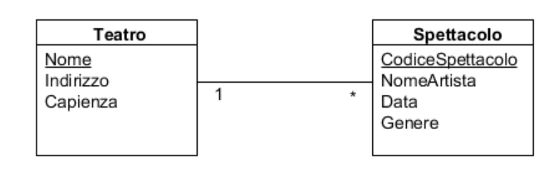

# uml-to-code

##Generate java code from xml uml description

Based on the "Mapping UML diagram to XML" work by Jitender Singh for JNU that you can find 
on [docs/utx_doc.pdf](docs/utx_doc.pdf).  
The purpose of this project is take the xml rapresentation of uml diagram and generate 
the relative java code that implement the CRUD access for various database pattern access.

###The mapping

To map a Uml we need to descripbe the output in a settings section and map the entity in a entities section.  
The setting section is composed of:

- _defaultPackage_ : package to use in the java code jenerated 
- _outputType_ : string that select the output type to generate for (DAO, HYBERNATE, BRUTE_FORCE)
- _outputPath_ : path where write the output code
- _useSurrogatesId_ : boolean value indacate to use or not surrugate ids

The entities block have to collect the entity description composed with:

- _ entyty_ :
    - _name_ attribute : the calss name in camel case (`<entity name="Teatro">`)
    - _attribute_ childrens : the class attributes with :
        - _name_ attribute : the name of the attribute
        - _sqlType_ attribute : sql type of the attribute
        - _null_ attribute : boolean value indicate the associated column allow null value or not
        - _primaryKey_ attribute : boolean value indicate the associated column is primary key for the table

##Pattern DAO

With this example diagram:



it's enought write the xml rappresentation:

```xml
<?xml version="1.0" encoding="utf-8"?>
<uml>
	<settings>
		<defaultPackage>it.nfantoni.dao.test</defaultPackage>
		<outputType>DAO</outputType>
		<outputPath>target/dao</outputPath>
		<useSurrogatesId>false</useSurrogatesId>
	</settings>
	<entities>
		<entity name="Teatro">
			<attribute name="Nome" sqlType="VARCHAR(255)" null="false" primaryKey="true" />
			<attribute name="Indirizzo" sqlType="VARCHAR(255)" />
			<attribute name="Capienza" sqlType="INT" />
            <association multiplicity="1" className="Spettacolo" />
		</entity>
		<entity name="Spettacolo">
			<attribute name="CodiceSpettacolo" sqlType="VARCHAR(255)" null="false" primaryKey="true" />
			<attribute name="NomeArtista" sqlType="VARCHAR(255)" />
			<attribute name="Data" sqlType="DATE" />
			<attribute name="Genere" sqlType="VARCHAR(255)" />
            <association multiplicity="*" className="Teatro" />
		</entity>
	</entities>
</uml>
```

and run the program to generate all java classes for crud operation based on Dao Pattern.